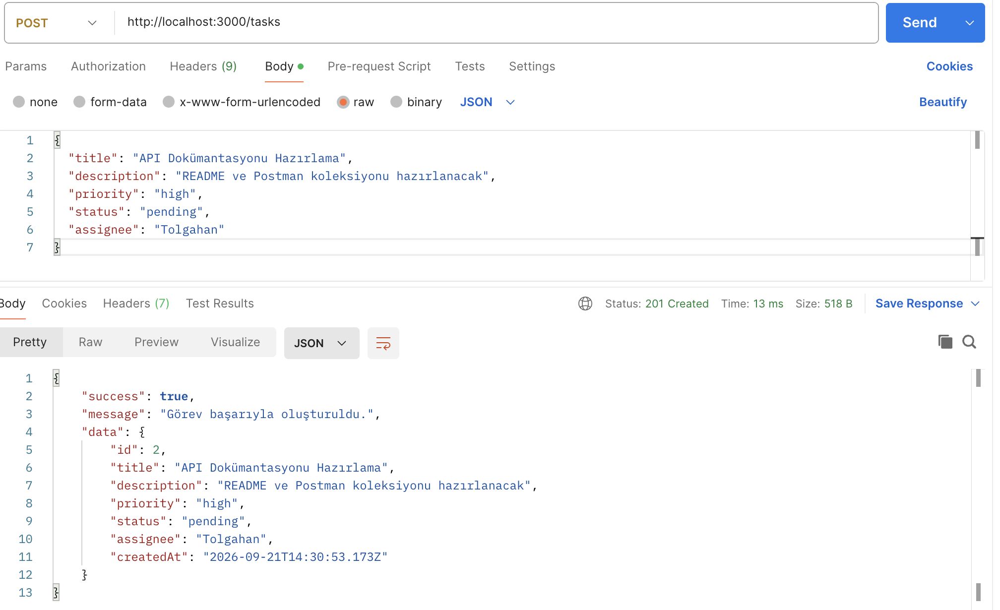
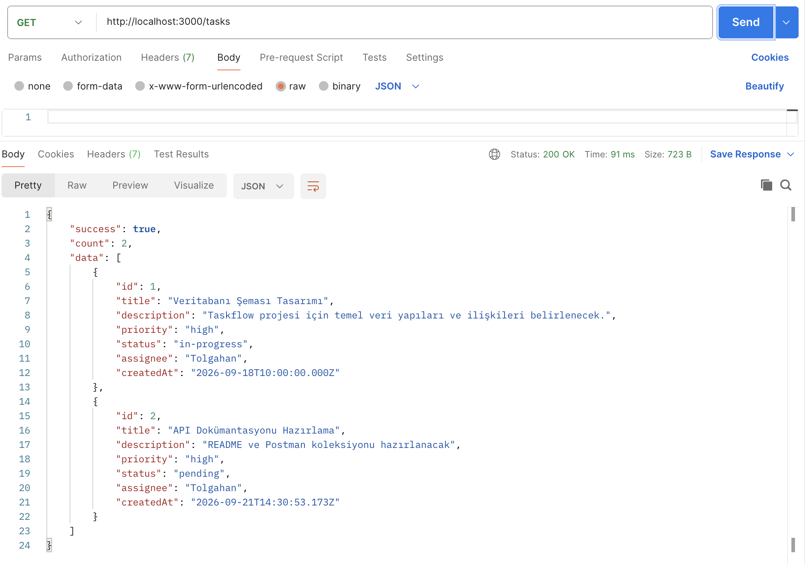
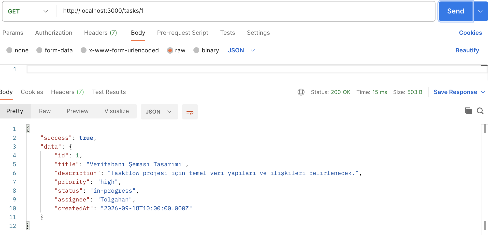
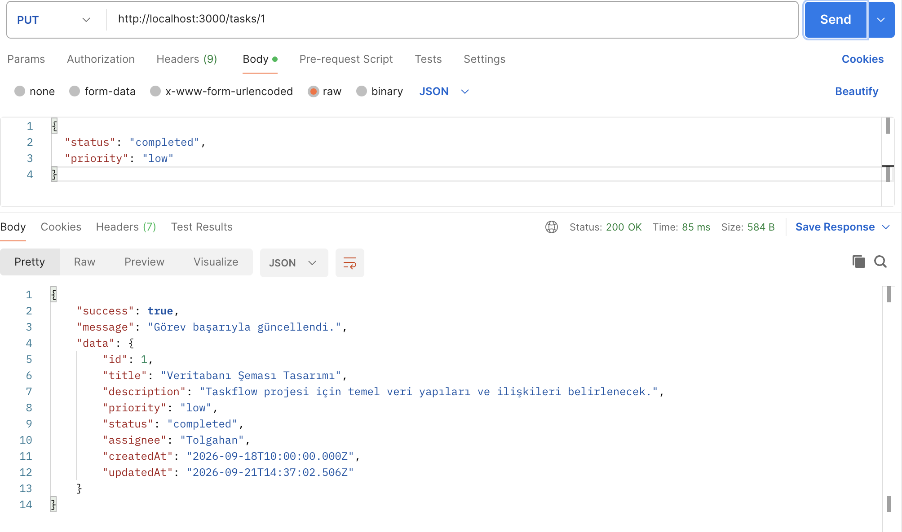
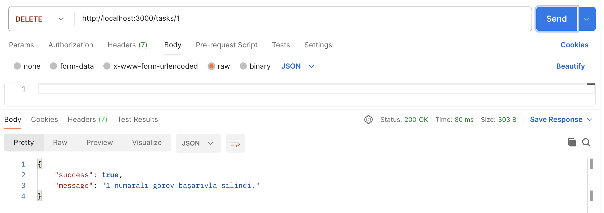

# TASKFLOW - Görev ve Proje Yönetim Sistemi REST API

TASKFLOW, bir yazılım şirketinin ekipleri arasındaki görevleri, öncelikleri ve çalışan sorumluluklarını takip etmesini sağlayan modüler bir RESTful API servisidir. Node.js ve Express.js mimarisiyle geliştirilmiş olup, dosya tabanlı JSON kalıcılığı ve özel middleware katmanları içerir.

---

## 📌 Proje Özeti ve Senaryo

* **Senaryo:** Yazılım geliştirme sürecinde ekiplerin görev oluşturabilmesi, bu görevleri takım üyelerine ataması, statü ve öncelik seviyelerini yönetebilmesi amacıyla tasarlanmıştır.

* **Mimari:** Modüler katmanlı mimari (Routing, Middleware, Utilities).

* **Veri Saklama:** `fs` modülü ile yerel dosya tabanlı kalıcı depolama (`data/tasks.json`).

* **Kayıt Mekanizması:** Gelen her HTTP isteğini metot, adres ve ISO zaman damgasıyla izleyen özel logger middleware.

---

## 📂 Proje Dizin Yapısı

```text
taskflow-api/

├── data/
│   └── tasks.json             # Kalıcı JSON veri deposu

├── docs/
│   └── postman/               # Postman CRUD doğrulama ekran görüntüleri

├── src/
│   ├── middleware/
│   │   └── logger.js          # HTTP istek günlüğü middleware'i
│   ├── routes/
│   │   └── tasks.js           # /tasks uç noktaları ve CRUD mantığı
│   ├── utils/
│   │   └── fileHelper.js      # fs modülü okuma/yazma yardımcıları
│   ├── app.js                 # Express konfigürasyonu ve ara yazılımlar
│   └── server.js              # Sunucu dinleyicisi ve port başlatıcı

├── .gitignore
├── package.json
└── README.md
```

---

## 🚀 Kurulum ve Çalıştırma

### Gereksinimler

* Node.js (v16 veya üzeri)
* npm (Node Package Manager)

### Adım Adım Kurulum

1. Repoyu yerel makinenize klonlayın:

   ```bash
   git clone https://github.com/mestan4/taskflow-api.git
   cd taskflow-api
   ```

2. Bağımlılıkları yükleyin:

   ```bash
   npm install
   ```

3. Geliştirme ortamını başlatın (Nodemon ile canlı izleme):

   ```bash
   npm run dev
   ```

4. Canlı üretim modunda başlatmak için:

   ```bash
   npm start
   ```

Sunucu varsayılan olarak http://localhost:3000 adresinde dinlemeye başlar.

---

## 📡 API Referansı ve Uç Noktalar

Temel URL: http://localhost:3000/tasks

| Metot      | Uç Nokta     | Açıklama                             | Beklenen Gövde / Parametre                                     | Durum Kodu                                     |
| :--------- | :----------- | :----------------------------------- | :------------------------------------------------------------- | :--------------------------------------------- |
| **GET**    | `/tasks`     | Kayıtlı tüm görevleri listeler       | -                                                              | `200 OK`                                       |
| **GET**    | `/tasks/:id` | Belirli bir görevin detayını getirir | URL Parametresi (`id`)                                         | `200 OK` / `404 Not Found`                     |
| **POST**   | `/tasks`     | Yeni bir görev kaydı oluşturur       | JSON: `title`, `description`, `priority`, `status`, `assignee` | `201 Created` / `400 Bad Request`              |
| **PUT**    | `/tasks/:id` | Görev bilgilerini günceller          | URL Parametresi (`id`), JSON güncelleme alanları               | `200 OK` / `400 Bad Request` / `404 Not Found` |
| **DELETE** | `/tasks/:id` | Belirli bir görevi sistemden siler   | URL Parametresi (`id`)                                         | `200 OK` / `404 Not Found`                     |

---

## 📸 Test ve Doğrulama Kanıtları (Postman)

Aşağıdaki ekran görüntüleri projenin tüm CRUD işlevlerini başarıyla yerine getirdiğini belgelemektedir:

### 1. Görev Oluşturma (POST /tasks - 201 Created)



### 2. Tüm Görevleri Listeleme (GET /tasks - 200 OK)



### 3. Görev Detayı (GET /tasks/:id - 200 OK)



### 4. Görev Güncelleme (PUT /tasks/:id - 200 OK)



### 5. Görev Silme (DELETE /tasks/:id - 200 OK)


